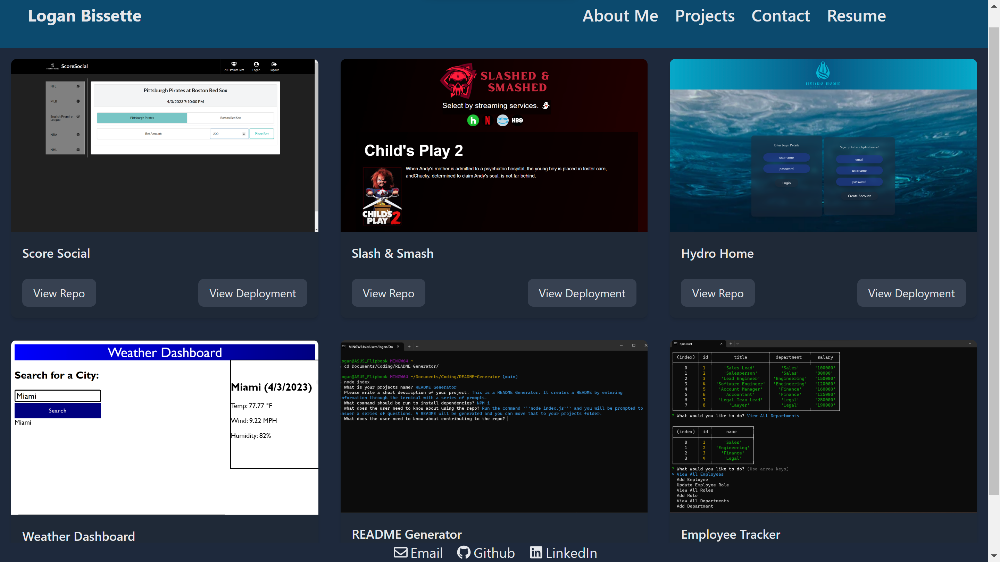

# React Portfolio

## Description

This is my portfolio made in React.

## Table of Contents

- [Installation](#installation)
- [Usage](#usage)
- [License](#license)
- [Questions](#questions)

## Installation

npm i to download the dependencies listed in the package.json.

## Usage

When you go to https://lbissette.github.io/react-portfolio/ you can see in the header there is an about me page, projects page, contact page, and a resume page. The about me contains a description about myself. The projects page lists 6 projects I have done through the bootcamp. The contact page shows a form that has restrictions on the email name and message forms. The resume page shows my resume and a download link.

## Contributing

Please fork your contributions

## License

The MIT License (MIT)
        Copyright © 2022
        
        Permission is hereby granted, free of charge, to any person obtaining a copy of this software and associated documentation files (the “Software”), to deal in the Software without restriction, including without limitation the rights to use, copy, modify, merge, publish, distribute, sublicense, and/or sell copies of the Software, and to permit persons to whom the Software is furnished to do so, subject to the following conditions:
        
        The above copyright notice and this permission notice shall be included in all copies or substantial portions of the Software.
        
        THE SOFTWARE IS PROVIDED “AS IS”, WITHOUT WARRANTY OF ANY KIND, EXPRESS OR IMPLIED, INCLUDING BUT NOT LIMITED TO THE WARRANTIES OF MERCHANTABILITY, FITNESS FOR A PARTICULAR PURPOSE AND NONINFRINGEMENT. IN NO EVENT SHALL THE AUTHORS OR COPYRIGHT HOLDERS BE LIABLE FOR ANY CLAIM, DAMAGES OR OTHER LIABILITY, WHETHER IN AN ACTION OF CONTRACT, TORT OR OTHERWISE, ARISING FROM, OUT OF OR IN CONNECTION WITH THE SOFTWARE OR THE USE OR OTHER DEALINGS IN THE SOFTWARE.

## Questions

My GitHub is https://github.com/lbissette. You can ask me questions by emailing me at loganbissette@gmail.com.
